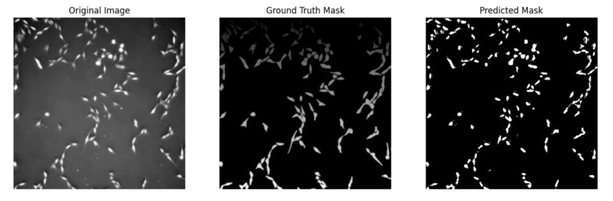
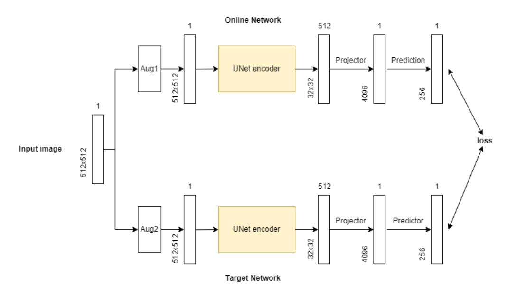
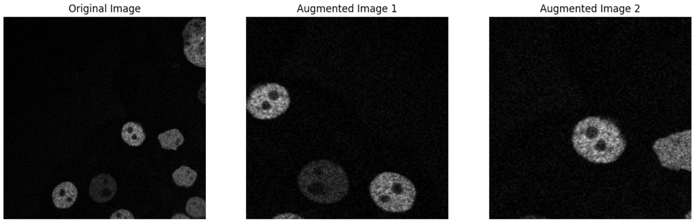
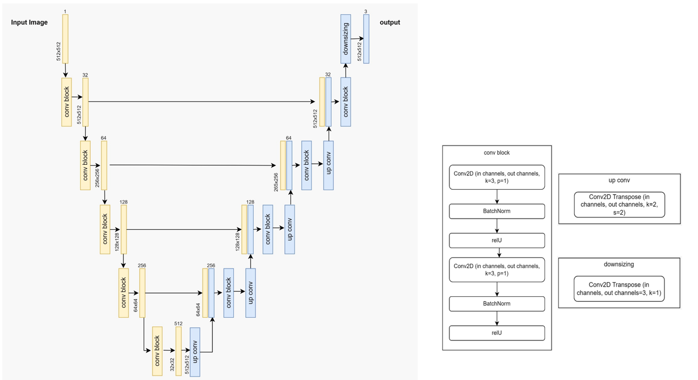
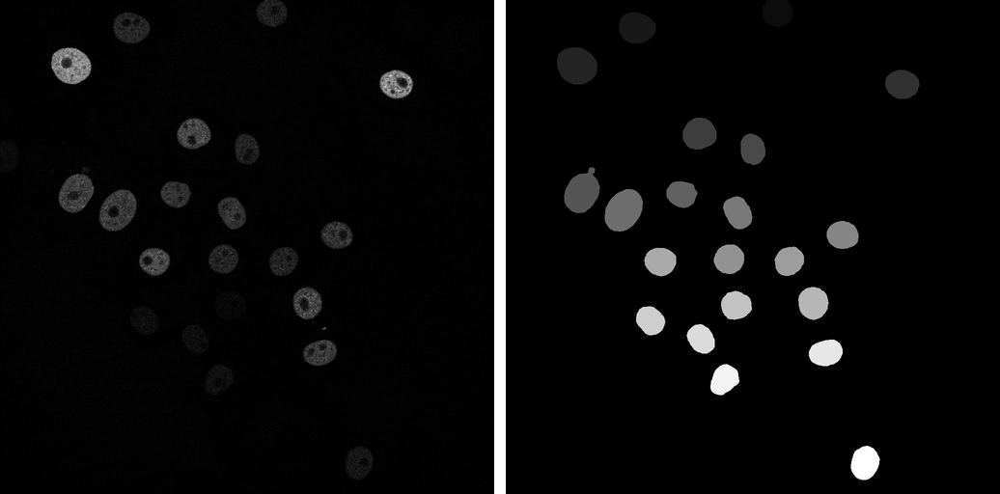
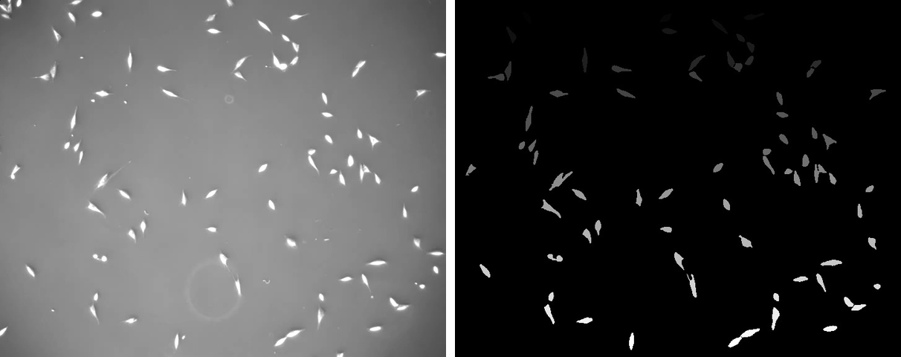
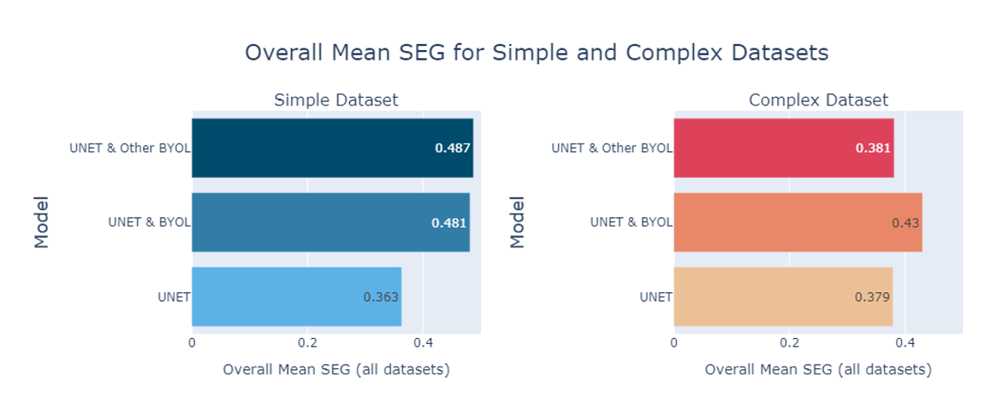
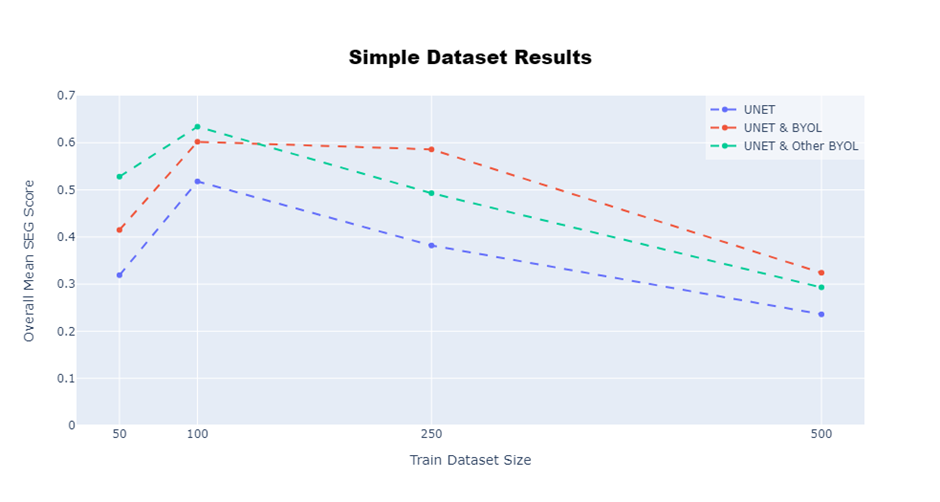
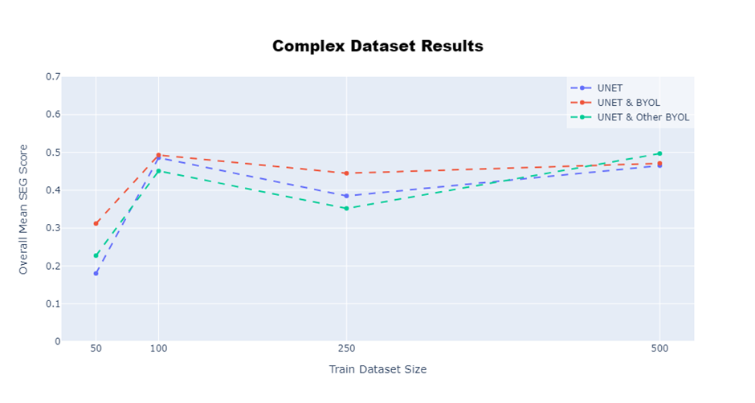
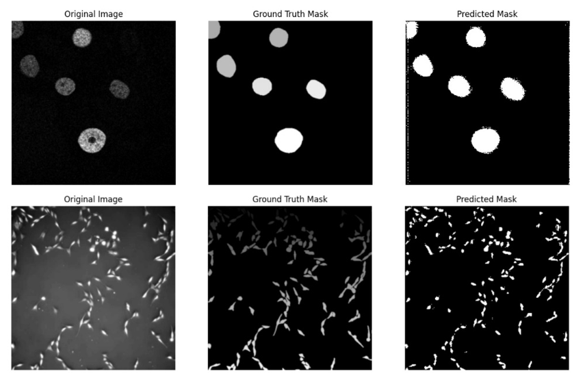

<h1 align="center">Cell Segmentation: A Self-Supervised Approach Using BYOL and UNet</h1>

<p align="center">
  
</p>

<p align="center">
  
  
  
  
  
  <a href="https://colab.research.google.com/github/Amit-Brilant/cell-segmentation-byol-unet/blob/main/main.ipynb"></a>
</p>

---

## Overview

As the final project of an academic course in "Deep Learning and its applications", we developed a novel self-supervised method for segmenting cell images by combining [BYOL](https://arxiv.org/abs/2006.07733) (Bootstrap Your Own Latent) and [UNet](https://arxiv.org/abs/1505.04597) architectures.

**🔬 Challenge:** Segmenting cell images is notoriously difficult due to the vast variations in cell shapes, sizes, and textures, alongside the scarcity of labeled datasets.

**💡 Solution:** We tackled this by pretraining the UNet encoder in a self-supervised manner, allowing it to learn meaningful representations from unlabeled data. These pre-trained weights were then fine-tuned in a supervised setting, boosting segmentation accuracy even when labeled data was limited.

**📈 Results:** Our self-supervised approach significantly improved segmentation performance across multiple datasets, highlighting its potential to generalize well and address data scarcity in medical imaging.

---

## Method

**Stage 1: self-supervised pretraining with BYOL.** The UNet encoder is trained on *unlabeled* cell images. Each image is augmented twice and the two views are fed through an online network and a target network. The online branch adds a projector and a predictor and is updated by gradient descent; the target branch is updated only by an exponential moving average of the online weights (decay 0.99). No negative pairs and no labels are needed.

<p align="center">
  
</p>

```math
\mathcal{L} = 0.5 \cdot \Big( \lVert p_{online} - z_{target} \rVert + \lVert z_{online} - p_{target} \rVert \Big)
```

The two views are produced by random resized crop (p=0.9), horizontal flip (p=0.5), rotation up to 10 degrees, and color jitter of brightness and contrast (p=0.3).

<p align="center">
  
</p>

**Stage 2: supervised fine-tuning.** The pretrained encoder weights are loaded into a standard UNet and the network is trained with a weighted cross-entropy loss. The encoder stays **frozen for the first two-thirds of training** so the gradient budget goes into the decoder, then it is **unfrozen** for the final third. Input is `512x512x1`, the bottleneck is `32x32x512`, and the output is `512x512x3`, one channel per class: **background**, **inside**, **edge**.

<p align="center">
  
</p>

---

## Data

Two 2D datasets from the [Cell Tracking Challenge](https://celltrackingchallenge.net/2d-datasets/), deliberately chosen to differ in difficulty. Masks come from the `N_ERR_SEG` directories.

**`Fluo-N2DH-GOWT1`, the "simple" dataset.** Well-separated fluorescent nuclei on a dark background, split directly into 512x512 patches.

<p align="center">
  
</p>

**`PhC-C2DL-PSC`, the "complex" dataset.** Many small, elongated, densely packed phase-contrast cells. The 512x512 center was cropped before patching.

<p align="center">
  
</p>

Binary masks are converted on the fly into a 3-class map: connected components label each cell, a Laplacian kernel marks their boundaries, and every pixel becomes background, inside, or edge. Modelling the edge class explicitly is what keeps touching cells apart instead of merging them into one blob.

---

## Experimental setup

Three variants were trained, on four training-set sizes, for each of the two datasets:

| Variant | Encoder initialization |
|---|---|
| **UNet** | Random (Kaiming normal). Supervised baseline. |
| **UNet & BYOL** | BYOL-pretrained on unlabeled images from the **same** dataset. |
| **UNet & Other BYOL** | BYOL-pretrained on unlabeled images from the **other** dataset (cross-dataset transfer). |

Train sizes were 50 / 100 / 250 / 500 labeled images with a 20% validation split, tested on 120 images (simple) and 100 images (complex). BYOL pretraining used 726 unlabeled images for the simple dataset and 600 for the complex one. Everything was trained with Adam at lr 1e-4, batch size 8, on a Colab L4 GPU. The simple dataset ran 10 epochs throughout; the complex dataset ran 10 / 8 / 6 / 4 epochs as the labeled set grew, because frames within a sequence are nearly identical, so more images behave like more repetitions and overfitting arrives sooner.

---

## Evaluation metric: SEG

Results are reported with **SEG**, the segmentation metric of the Cell Tracking Challenge: the mean Jaccard index over all reference objects, where a predicted object counts as a match only if it covers more than half of the reference object.

```math
SEG = \frac{1}{|R|} \sum_{i=1}^{|R|} \sum_{j=1}^{|R|} J(R_i, S_j)
```

```math
J(R_i, S_j) = \begin{cases}
\dfrac{|R_i \cap S_j|}{|R_i \cup S_j|} & \text{if } |R_i \cap S_j| > 0.5 \cdot |R_i| \\
0 & \text{otherwise}
\end{cases}
```

where $R_i$ is the i-th reference object in the ground truth mask and $S_j$ the j-th object in the predicted mask. Because objects are matched one to one, SEG punishes merged cells heavily: two cells predicted as a single blob score zero for at least one of them.

---

## Results

| Train size | Simple: UNet | Simple: + BYOL | Simple: + Other BYOL | Complex: UNet | Complex: + BYOL | Complex: + Other BYOL |
|---:|---:|---:|---:|---:|---:|---:|
| 50 | 0.32 | 0.41 | **0.53** | 0.16 | **0.31** | 0.23 |
| 100 | 0.52 | 0.60 | **0.63** | **0.49** | **0.49** | 0.45 |
| 250 | 0.38 | **0.59** | 0.49 | 0.39 | **0.45** | 0.35 |
| 500 | 0.24 | **0.32** | 0.29 | 0.47 | 0.47 | **0.50** |
| **Overall mean** | 0.363 | 0.481 | **0.487** | 0.379 | **0.430** | 0.381 |

Improvement over the supervised UNet baseline, averaged over all training-set sizes:

| Dataset | UNet & BYOL | UNet & Other BYOL |
|---|---:|---:|
| Simple (`Fluo-N2DH-GOWT1`) | **+11.8%** | **+12.4%** |
| Complex (`PhC-C2DL-PSC`) | **+5.1%** | +0.2% |

<p align="center">
  
</p>

**Every BYOL-pretrained variant beats the plain UNet on average, on both datasets.** Two further observations stand out.

<p align="center">
  
  
</p>

**Pretraining on a harder dataset helps a simpler one.** On the simple dataset the encoder pretrained on the *complex* images scored highest overall (0.487) and dominated at the smallest training set (0.53 versus 0.32 for the baseline at 50 images). Richer unlabeled data appears to yield a more general feature extractor. The reverse does not hold: on the complex dataset the encoder pretrained on the simple images was the weakest of the three at every size except 500.

**More labels did not mean better scores.** Performance peaks at 100 images on both datasets and then declines. Because consecutive frames of a time-lapse sequence are almost identical, enlarging the labeled set adds little new information while making it easy for the model to memorize. The gain from BYOL is largest exactly where labels are scarcest, which is the regime the method was designed for.

---

## Qualitative results

<p align="center">
  
</p>

Top row: simple dataset, with edge pixels rendered white. Bottom row: complex dataset, with edge pixels rendered black.

Post-processing offers a genuine trade-off. Assigning the predicted **edge** class to white merges each cell with its own boundary and raises the SEG score, but the cells visually run into each other. Assigning it to black draws a one-pixel gutter around every cell, which looks cleaner and separates neighbouring cells far better, at the cost of a slightly lower SEG.

---

## Conclusions and future work

**Conclusions**

- **BYOL pretraining pays off.** UNet & BYOL and UNet & Other BYOL both reach a higher average SEG score than the plain UNet on both dataset types.
- **Pretraining diversity matters.** Pretraining on a different and more complex dataset can produce better results, especially for smaller and simpler labeled sets, where it seems to offer a complementary feature representation.
- **Training gets cheaper.** With a pretrained encoder most of the computational effort goes into the decoder alone, cutting training time and the number of epochs needed.
- **Freeze, then unfreeze.** The most effective schedule was to update only the decoder for the first two-thirds of training and release the encoder for the last third.

**Future work**

- Pretrain BYOL on many varied unlabeled datasets containing different cell types, then fine-tune to a specific task. In complex segmentation problems this should improve flexibility by extracting a wider range of features.
- Test the same pretraining recipe against more advanced segmentation backbones, such as ViT-based models.
- Develop a loss function aligned with the SEG metric, weighting pixels by their contribution to the score with particular emphasis on edge pixels.

---

## Notes and known limitations

This repository preserves the code as it was submitted for the course. A few things are worth flagging for anyone reading or reusing it:

- **Double softmax.** `UNetDecoder.forward` applies `nn.Softmax` to its output, and the training loop then passes that output to `nn.CrossEntropyLoss`, which applies `log_softmax` internally. The results reported above were produced with this behavior, so it has been left in place rather than silently corrected.
- **Loss weights.** The class weights default to `[0.15, 0.35, 0.4]` in the code, while the report describes `[0.2, 0.35, 0.45]`. The relative ordering, background < inside < edge, is the same in both.
- **Reproducibility.** The original submission set no random seeds. A seed cell has been added to the notebook, but the reported numbers predate it and were produced from unseeded runs.
- **Fixed input size.** The flattened encoder output dimension hardcodes a 512x512 input.
- **Score ceiling.** SEG peaks around 100 labeled images and drops afterwards. See the [Results](#results) section for why.

---

## References

1. Ronneberger, O., Fischer, P., & Brox, T. (2015). *U-Net: Convolutional Networks for Biomedical Image Segmentation.* [arXiv:1505.04597](https://arxiv.org/abs/1505.04597)
2. Grill, J.-B., Strub, F., Altché, F., Tallec, C., Richemond, P. H., Buchatskaya, E., Doersch, C., Pires, B. A., Guo, Z. D., Azar, M. G., Piot, B., Kavukcuoglu, K., Munos, R., & Valko, M. (2020). *Bootstrap Your Own Latent: A New Approach to Self-Supervised Learning.* [arXiv:2006.07733](https://arxiv.org/abs/2006.07733)
3. Cell Tracking Challenge, 2D datasets. https://celltrackingchallenge.net/2d-datasets/

---

## Authors

**Amit Barilant** and **Alon Finestein**

Final project for the course *Deep Learning and its Applications to Signal and Image Processing and Analysis*, August 2024.

Licensed under the [MIT License](LICENSE).
